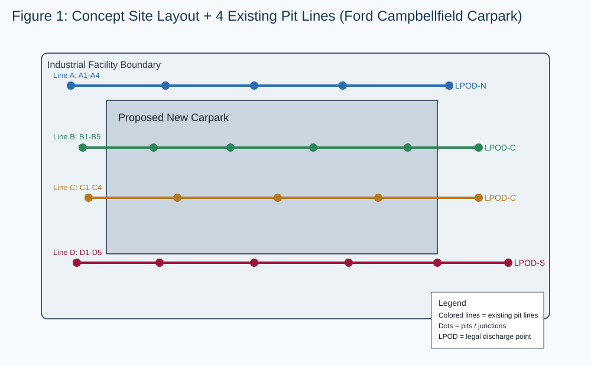
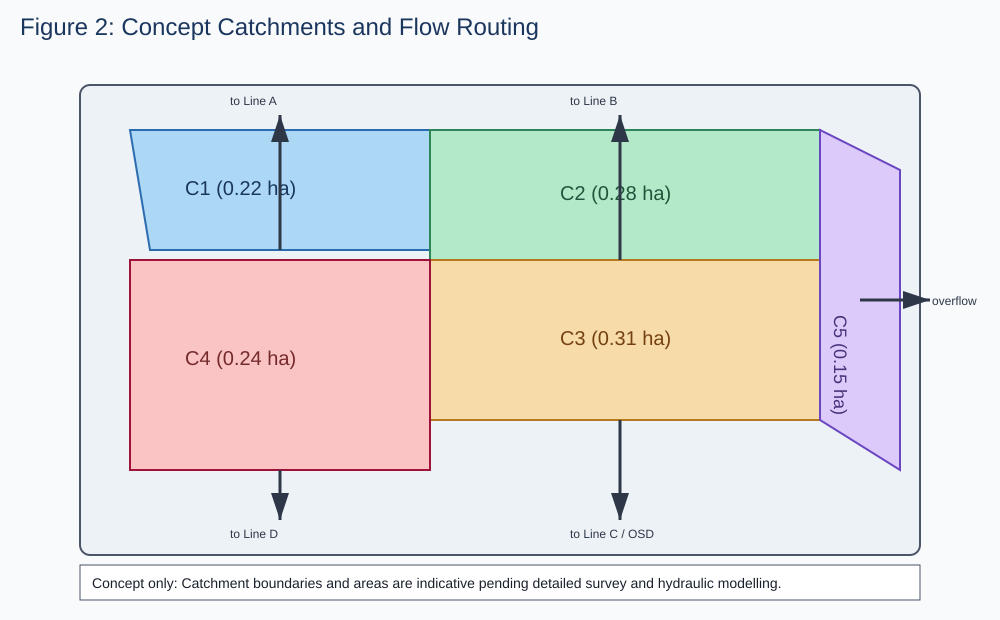

# Step-by-Step SWMP Plan (Australia)  
## New Proposed Carpark – Ford Industrial Facility, Campbellfield VIC

> **Important**: This is a worked planning example for concept design/documentation. Final design, approvals, and certification must be completed by appropriately qualified professionals and lodged with the relevant authority.

## 1) Project Definition and Scope

### 1.1 Objective
Prepare a **Stormwater Management Plan (SWMP)** for a proposed new carpark within an industrial Ford site in Campbellfield, Victoria, including:
- Existing drainage interpretation
- Four simulated lines of existing pits
- Catchment delineation and runoff routing
- Concept stormwater treatment and detention strategy
- Concept drainage sizing workflow
- Final reporting framework

### 1.2 Assumed Site Context (for this design example)
- Location: Campbellfield industrial precinct (City of Hume context)
- Land use: Existing industrial operations + new sealed carpark
- Carpark concept area: ~1.20 ha total design precinct
- New impervious area added: ~0.85 ha (asphalt + concrete)
- Existing pits/outfalls connected to local legal point of discharge (LPOD)

---

## 2) Regulatory and Design Framework (Australia / Victoria)

Use these as the primary governance checks in sequence:

1. **Local council requirements (City of Hume)**
   - Planning permit/drainage conditions
   - On-site detention (OSD) and discharge limits (if required)
   - WSUD quality targets and stormwater treatment expectations
2. **Melbourne Water / relevant drainage authority requirements**
   - Legal point of discharge confirmation
   - Flood level and overland flow/pathway constraints
3. **State policy and standards**
   - Clause 19.03-3S (Integrated Water Management)
   - EPA Vic stormwater pollution expectations
   - Austroads / ARR 2019 hydrology methods where relevant
4. **Engineering standards**
   - AS/NZS pipe and pit standards, road authority standards, and approved materials

**Why this step matters:** SWMP compliance controls allowable discharge, quality outcomes, and what will be approved.

---

## 3) Step-by-Step SWMP Workflow

## Step 1 – Collect Base Inputs

### What to collect
- Feature and level survey (ground levels, buildings, kerbs, pits, pipes, invert levels)
- Services and utility plans
- Existing CCTV/drainage records (if available)
- Geotechnical infiltration information
- Existing flood/overland flow information

### Why
Reliable design depends on confirmed invert levels, grades, and practical outfall constraints.

### Deliverable
- Existing conditions plan
- Drainage asset register

---

## Step 2 – Simulate Existing Drainage (4 Pit Lines)

For this project, existing infrastructure is represented by **4 lines of pits**:

- **Line A (Northern boundary):** A1 → A2 → A3 → A4 → LPOD-N
- **Line B (Central-west):** B1 → B2 → B3 → B4 → B5 → LPOD-C
- **Line C (Central-east):** C1 → C2 → C3 → C4 → LPOD-C
- **Line D (Southern boundary):** D1 → D2 → D3 → D4 → D5 → LPOD-S

### Simulated assumptions
- Pit spacing: 35–50 m typical
- Pipe diameters: 300–525 mm (existing mixed network)
- Typical grades: 0.4%–1.2%
- Existing network generally drains west to east with southern overland fallback

### Why
This creates a rational baseline to test how new runoff from the carpark integrates with existing capacity and flow paths.

---

## Step 3 – Define Catchments

Split site into logical catchments based on topography and pit capture:

- **C1 (NW hardstand + carpark edge):** 0.22 ha → Line A
- **C2 (Main carpark north):** 0.28 ha → Line B
- **C3 (Main carpark south):** 0.31 ha → Line C
- **C4 (Service lane + loading edge):** 0.24 ha → Line D
- **C5 (Landscape/permeable strips):** 0.15 ha (partial infiltration + overflow)

### Considerations
- Finished surface grading to avoid ponding at parking bays and entries
- Capture of first flush pollutants from traffic areas
- Emergency overland path away from buildings
- Avoid surcharge impacts at property boundaries

### Why
Catchments are the basis for runoff, detention sizing, treatment sizing, and pit/pipe checks.

---

## Step 4 – Hydrology Setup (Minor and Major Events)

### Adopt events
- Minor system check: **20% AEP (1 in 5 year)**
- Capacity check: **10% AEP (1 in 10 year)**
- Major/flood safety check: **1% AEP (1 in 100 year)**

### Method
Use Rational Method for concept calculations:

\[
Q = 0.278 \times C \times I \times A
\]

Where:
- \(Q\) = peak flow (m³/s)
- \(C\) = runoff coefficient
- \(I\) = rainfall intensity (mm/hr)
- \(A\) = area (km²)

### Typical coefficients (concept)
- Asphalt/concrete: C = 0.85–0.95
- Roof: C = 0.90
- Landscaped/permeable: C = 0.20–0.35

### Why
Hydrology defines expected flow rates and therefore sizes of treatment, pipes, and storage.

---

## Step 5 – Water Quality (WSUD) Strategy

### Proposed treatment train
1. **Gross Pollutant Trap (GPT)** at primary trunk inlet
2. **Hydrodynamic separator** for hydrocarbons/sediment from traffic runoff
3. **Bio-retention / raingarden strip** (where space allows)
4. **Overflow bypass** to detention/outfall line

### Design intent
- Improve TSS/TP/TN reductions in line with local targets
- Treat first flush from carpark contaminant load
- Provide maintainable assets in operational industrial environment

### Why
Industrial vehicle areas can export sediment, hydrocarbons, and nutrients; treatment is usually a permit condition.

---

## Step 6 – Detention and Discharge Control

### Concept approach
- Provide an **OSD basin/tank** downstream of treatment assets
- Throttle discharge to council/authority allowable release rate
- Route major event exceedance via overland flood path

### Concept sizing workflow
1. Build inflow hydrograph from catchments C1–C5
2. Apply permissible site discharge (PSD)
3. Determine required storage volume from inflow–outflow difference
4. Check drain-down time against authority criteria
5. Confirm no adverse downstream surcharge

### Why
Detention protects downstream drainage and helps satisfy permit discharge limits.

---

## Step 7 – Concept Pipe/Pit Design Checks

Perform checks for each line A–D:

- Pipe capacity under 20% and 10% AEP events
- Hydraulic grade line (HGL) below critical pit rims in minor event
- Pit spacing and bypass risk at low points
- Inlet efficiency along kerb lines
- Major event exceedance route for 1% AEP

### Typical upgrade outcomes (concept)
- Upsize selected branches from 300 mm to 375/450 mm
- Add new capture pits at carpark sag points
- Regrade local pipe sections to maintain self-cleansing velocity

---

## Step 8 – Constructability, Operations, and Safety

### Constructability
- Stage tie-ins to maintain facility operation
- Verify cover/depth around existing utilities
- Confirm maintenance vehicle access to GPT and pits

### O&M requirements
- GPT cleaning frequency schedule
- Sediment inspection points
- Bio-retention maintenance plan
- Post-storm inspection checklist

### Safety
- No uncontrolled major flow toward buildings
- No traffic conflict at pit maintenance points
- Include spill response integration for industrial site runoff

---

## 4) Final Concept Design Summary (Example)

- SWMP developed with 5 catchments and 4 existing pit lines (A–D)
- Carpark runoff intercepted and treated before discharge
- OSD included to control post-development peak flow
- Minor system checks indicate feasible pipe/pit upgrades at key low points
- Major flow route preserved along southern overland corridor
- Concept layout suitable for detailed design, authority review, and permit support

---

## 5) Final Report Structure (Submission Template)

Use the following structure for the final SWMP report:

1. **Executive Summary**
2. **Project Background and Scope**
3. **Existing Conditions**
   - Survey, drainage assets, 4 pit line mapping
4. **Design Criteria and Regulatory Requirements**
5. **Catchment Delineation and Hydrology**
6. **Water Quality Strategy (WSUD)**
7. **Detention and Discharge Assessment**
8. **Pipe/Pit Capacity and Flood Path Checks**
9. **Risk, Constructability, and Maintenance**
10. **Conclusions and Recommendations**
11. **Appendices**
   - Calculations
   - Model outputs
   - Drawings
   - Asset schedules

---

## 6) Figures (Included)

### Figure 1 – Concept Site Layout and Existing Pit Lines

### Figure 2 – Concept Catchments and Flow Routing

---

## 7) Key Design Considerations Checklist

- [x] Confirm legal point of discharge and authority conditions
- [x] Simulate and verify 4 existing pit lines (A, B, C, D)
- [x] Define catchments based on levels and surface grading
- [x] Size treatment train for carpark pollutant loads
- [x] Size detention to permissible discharge
- [x] Check minor and major event performance
- [x] Confirm maintainability and operational access

